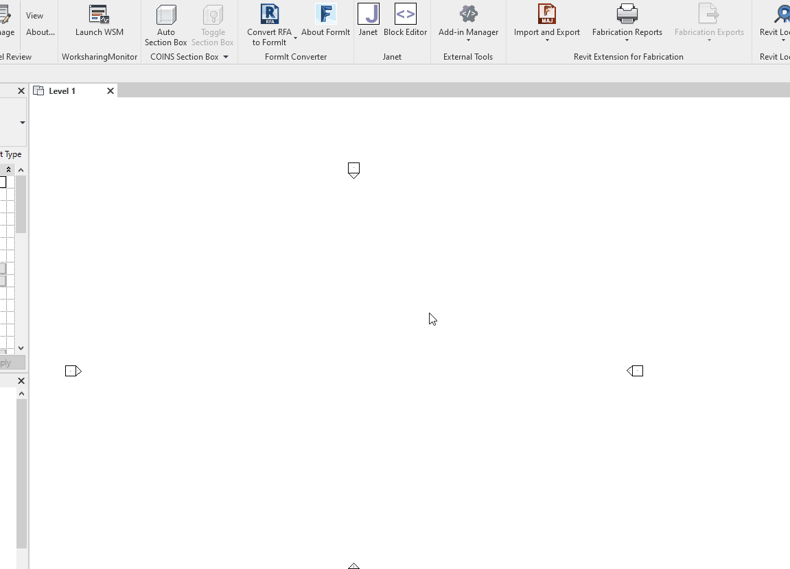

<div id="top"></div>
<!--
*** Thanks for checking out the Best-README-Template. If you have a suggestion
*** that would make this better, please fork the repo and create a pull request
*** or simply open an issue with the tag "enhancement".
*** Don't forget to give the project a star!
*** Thanks again! Now go create something AMAZING! :D
-->


<!-- PROJECT SHIELDS -->
<!--
*** I'm using markdown "reference style" links for readability.
*** Reference links are enclosed in brackets [ ] instead of parentheses ( ).
*** See the bottom of this document for the declaration of the reference variables
*** for contributors-url, forks-url, etc. This is an optional, concise syntax you may use.
*** https://www.markdownguide.org/basic-syntax/#reference-style-links
-->
[![Contributors][contributors-shield]][contributors-url]
[![Forks][forks-shield]][forks-url]
[![Stargazers][stars-shield]][stars-url]
[![Issues][issues-shield]][issues-url]
[![MIT License][license-shield]][license-url]
[![LinkedIn][linkedin-shield]][linkedin-url]


<!-- PROJECT LOGO -->
<br />
<div align="center">
  <a href="https://github.com/vtdevelopment/janet-revit">
    
  </a>

<h3 align="center">Janet</h3>

  <p align="center">
    Janet is a simple tool for creating and executing small C# scripts in Autodesk Revit by attaching them to hotkeys. 
    <br />
    <a href="https://github.com/vtdevelopment/janet-revit/wiki"><strong>Explore the docs »</strong></a>
    <br />
    <br />
    <a href="https://github.com/vtdevelopment/janet-revit/issues">Report Bug</a>
    ·
    <a href="https://github.com/vtdevelopment/janet-revit/issues">Request Feature</a>
  </p>
</div>


<!-- TABLE OF CONTENTS -->
<details>
  <summary>Table of Contents</summary>
  <ol>
    <li>
      <a href="#about-the-project">About The Project</a>
    </li>
    <li>
      <a href="#getting-started">Getting Started</a>
      <ul>
        <li><a href="#prerequisites">Prerequisites</a></li>
        <li><a href="#installation">Installation</a></li>
      </ul>
    </li>
    <li><a href="#usage">Usage</a></li>
    <li><a href="#roadmap">Roadmap</a></li>
    <li><a href="#contributing">Contributing</a></li>
    <li><a href="#license">License</a></li>
    <li><a href="#contact">Contact</a></li>
    <li><a href="#acknowledgments">Acknowledgments</a></li>
  </ol>
</details>


<!-- ABOUT THE PROJECT -->
## About The Project

<br/>

Janet was created to empower Revit users with a new way of creating small macros for daily work automation. Adding Janet command as a keyboard shortcut and connecting hotkeys to pieces of C# code is a fast and seamless process. Janet uses Roslyn libraries to compile the code during Revit runtime, so you can edit your code without closing Revit. Any text editor can be used to edit macro's code and changing them is as simple as just opening a file and saving it.

The name "Janet" is inspired by a character of the same name from <a href="https://thegoodplace.fandom.com/wiki/Janet">"The Good Place"</a> series. Janet works as a helpful assistant and can create anything you wish in the boundless void that is Autodesk Revit.

<p align="right">(<a href="#top">back to top</a>)</p>


<!-- GETTING STARTED -->
## Getting Started

There are two ways of running the application:
1. Downloading the newest release .msi installer from [Releases](https://github.com/vtdevelopment/janet-revit/releases)
2. Cloning this repo and building the addin yourself - [Build](https://github.com/vtdevelopment/janet-revit#build)

### Prerequisites

This software is a Revit Addin based on .NET Framework. In order to utilize it, you need:
* Windows machine
* Autodesk Revit 2020-2023
* Text editor for modifying .cs files (e.g. [Visual Studio Community](https://visualstudio.microsoft.com/vs/community/), [Visual Studio Code](https://code.visualstudio.com/), [Notepad++](https://notepad-plus-plus.org/))

### Build
If you'd like to compile your own build of Janet, just follow these simple steps:

1. Clone the repo
   ```sh
   git clone https://github.com/vtdevelopment/janet-revit.git
   ```
2. Build the solution in your code editor
3. Copy the .addin file to Revit Addin folder
4. Open Revit and the addin should load without problems. Janet panel should be visible in the Add-ins tab.

<p align="right">(<a href="#top">back to top</a>)</p>

### Installation
Download the newest release from [Releases](https://github.com/vtdevelopment/janet-revit/releases) and install Janet. After installation there should be a Janet panel in the Add-ins tab.

<!-- USAGE EXAMPLES -->
## Usage

### Starting Janet
You can start Janet as follows:
1. Open Revit and a project/family file.
2. Navigate to Add-Ins tab.
3. Locate the `Janet` panel.
4. Click the `Janet` button.
5. A window with message should appear. Now you can press a button connected to your Janet Block and start it up.

### Adding shortcut to Janet
While you can operate Janet by starting the application from the Add-Ins tab, it is not the fastest way to do it.
In order to speed up this process, it's recommended to add a keyboard shortcut to Janet in Revit:

1. Click on the `File` tab in the Revit ribbon.
2. Select `Options`. Revit options window should show up.
3. Navigate to `User Interface` tab in the navigation list on the left.
4. Press the `Customize` button for the `Keyboard Shortcuts` option.
5. Search for "Janet" in the search input.
6. Select the `Janet` command.
7. Click on the `Press new keys` input, press keyboard button (We recommend `J` for `Janet`!) and click `Assign` button.
8. Click `OK` button. Your shortcut is assigned now and you should be able to start Janet by pressing your configured shortcut!

### Working with Blocks

Scripts and macros used by Janet will be always referred to as ***Blocks***.
Blocks can be found in My Documents folder, inside ***Janet Blocks*** folder.

Blocks are essentialy C# files. Here's an example Block:
```csharp
//KeyCode:KEY_T
//Name:Test
public class TestMacro: IJanetBlock
{
    public void Execute(UIApplication uiapp)
    {
        TaskDialog.Show("Welcome message", "A simple test!");
    }
}

return typeof(TestMacro);
```
If you're just using the Block and want to simply change its name or hotkey, what interests you is the metadata contained in the comments on the top of the file:
```csharp
//KeyCode:KEY_T
//Name:Test
```

- `KeyCode` is the hotkey to which the macro is mapped to. Any letter on the keyboard can be used, and needs to be specified using this syntax: `KEY_<INSERT_LETTER>`, e.g. `KEY_A`, `KEY_B`.
- `Name` is a human-readable name for the Block. It shows up in the Block Editor and allows you to locate the Block from the Editor.

### Adding new Blocks

New Blocks can be added by creating a new file in the `Janet Blocks` directory located in My Documents.
There are certain criteria a Block needs to keep in order to execute correctly in Janet.

- The class needs to implement `IJanetBlock` interface by having a public `Execute` method, which takes `UIApplication` object in the constructor.
- The `UIApplication` object is the base object for reaching into the Revit document and extracting/modifying data in it.
- The Block needs to return the class at the very end. This is because the Block compiles to the class implementing the `IJanetBlock` and then runs the `Execute` method. The Block needs to return the class object in order for the Roslyn library to compile it properly.
- Block needs to comments with metadata for name nad hotkey - `KeyCode` and `Name`.

Example Block, returning the title of the current Revit Document, could looks something like this:
```csharp
//KeyCode:KEY_A
//Name:Get document title
public class JanetTitleMacro: IJanetBlock
{
    public void Execute(UIApplication uiapp)
    {
        Document doc = uiapp.ActiveUIDocument.Document;
        TaskDialog.Show("Document title", doc.Title);
    }
}

return typeof(JanetTitleMacro);
```

<p align="right">(<a href="#top">back to top</a>)</p>

## Roadmap

To be announced!

See the [open issues](https://github.com/vtdevelopment/janet-revit/issues) for a full list of proposed features (and known issues).

<p align="right">(<a href="#top">back to top</a>)</p>


<!-- CONTRIBUTING -->
## Contributing

Janet team welcomes all contributions. We want the AEC industry to work smarter and faster in Revit. Any contributions, either in code, documentation or feature requests you make are **greatly appreciated**.

If you have a suggestion that would make this better, please fork the repo and create a pull request. You can also simply open an issue with the tag "enhancement".
Don't forget to give the project a star! Thanks again!

1. Fork the Project
2. Create your Feature Branch (`git checkout -b feature/AmazingFeature`)
3. Commit your Changes (`git commit -m 'Add some AmazingFeature'`)
4. Push to the Branch (`git push origin feature/AmazingFeature`)
5. Open a Pull Request

<p align="right">(<a href="#top">back to top</a>)</p>


<!-- LICENSE -->
## License

Distributed under the MIT License. See `LICENSE.txt` for more information.

<p align="right">(<a href="#top">back to top</a>)</p>


<!-- CONTACT -->
## Contact

Karol Jedruszek - karol.jedruszek@viatechnik.com

Project Link: [https://github.com/vtdevelopment/janet-revit](https://github.com/vtdevelopment/janet-revit)

<p align="right">(<a href="#top">back to top</a>)</p>


<!-- MARKDOWN LINKS & IMAGES -->
<!-- https://www.markdownguide.org/basic-syntax/#reference-style-links -->
[contributors-shield]: https://img.shields.io/github/contributors/vtdevelopment/janet-revit.svg?style=for-the-badge
[contributors-url]: https://github.com/vtdevelopment/janet-revit/graphs/contributors
[forks-shield]: https://img.shields.io/github/forks/vtdevelopment/janet-revit.svg?style=for-the-badge
[forks-url]: https://github.com/vtdevelopment/janet-revit/network/members
[stars-shield]: https://img.shields.io/github/stars/vtdevelopment/janet-revit.svg?style=for-the-badge
[stars-url]: https://github.com/vtdevelopment/janet-revit/stargazers
[issues-shield]: https://img.shields.io/github/issues/vtdevelopment/janet-revit.svg?style=for-the-badge
[issues-url]: https://github.com/vtdevelopment/janet-revit/issues
[license-shield]: https://img.shields.io/github/license/vtdevelopment/janet-revit.svg?style=for-the-badge
[license-url]: https://github.com/vtdevelopment/janet-revit/blob/master/LICENSE.txt
[linkedin-shield]: https://img.shields.io/badge/-LinkedIn-black.svg?style=for-the-badge&logo=linkedin&colorB=555
[linkedin-url]: https://linkedin.com/in/linkedin_username
[product-screenshot]: Docs/Images/janet_test.gif
